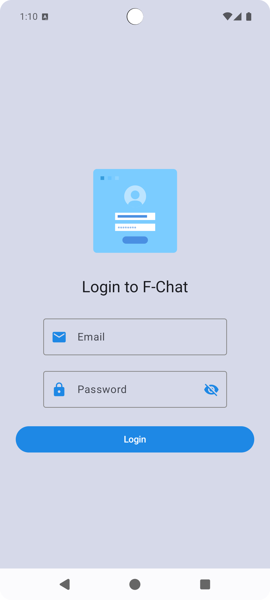
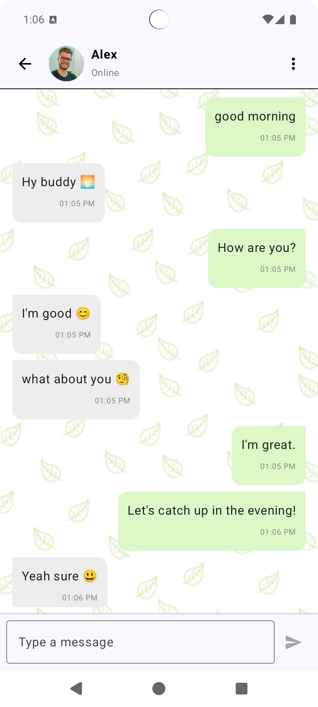

# FChat - Firebase Chat App 📱💬

FChat is a real-time chat application built using **Jetpack Compose** and **Firebase**, designed to enable seamless 1-on-1 messaging between authenticated users.

---

## 🚀 Features

- 🔐 Firebase Authentication (Email/Password)
- 💬 Real-time 1-on-1 messaging via Firebase Firestore
- 📲 Jetpack Compose UI with clean and responsive design
- ✅ Modern Android architecture (MVVM + State management)
- ⏱ Timestamp for each message
- 🔄 Live message updates with proper sender/receiver UI distinction

---

## 🧱 Tech Stack

- **Kotlin + Jetpack Compose**
- **MVVM Architecture**
- **Firebase Authentication**
- **Firebase Firestore**
- **Material 3 UI**
- **Kotlin Coroutines + Flow**

---

## 📸 Screenshots

| Login | Chat |
|-------|------|
|  |  |

---

## 🛠️ Setup Instructions

1. **Clone this repo**  
   ```bash
   git clone https://github.com/akashofficialdev/FirebaseChat.git
